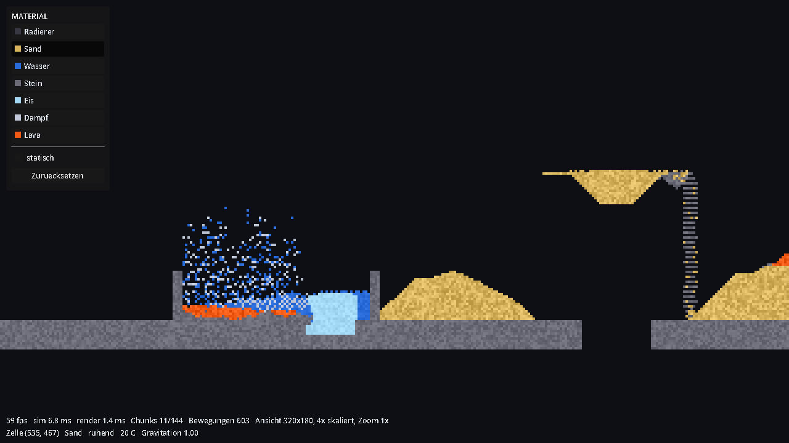

# Sand Simulation

Falling-Sand-Simulation in Godot 4.7, GDScript. Eine Zelle ist ein Pixel. Fuenf
zusammenspielende Systeme: eine Bewegungs-FSM pro Zelle, eine
temperaturgetriebene Aggregatzustands-FSM, ein statisches, aber ortsabhaengiges
Gravitationsfeld, ein Brand, der sich von aussen nach innen frisst, und ein
Druck entlang der Schwerkraft, der Holz zu Kohle und Kohle zu Diamant presst.



## Aufbau: alles ist ein Knoten in der Szene

Es gibt keine versteckten Singletons und keine statische Registry. Jeder
zentrale Baustein ist ein Knoten in `scenes/main.tscn` und wird dort im Editor
mit den anderen verdrahtet:

```
Main                        main.gd - Schleife und Tastenkuerzel
├── MaterialRegistry        haelt die MaterialLibrary, baut die Lookups
├── SandSimulation          Bewegung, Waerme, Zustandswechsel
├── DemoWorld               Startinhalt: Steinboden und Gravitationszonen
├── WorldLayer
│   └── WorldView           skaliert die Spielansicht ganzzahlig ins Fenster
├── WorldViewport           SubViewport in Weltaufloesung
│   ├── WorldRenderer       Gitter -> Textur
│   └── WorldCamera         schwenken und zoomen
├── PaintTool               zeichnen und radieren
└── UiLayer
    ├── Toolbar             Materialauswahl (scenes/ui/toolbar.tscn)
    └── Hud                 zwei Zeilen unten links (scenes/ui/hud.tscn)
```

Alle Verweise zwischen diesen Knoten sind `@export`-Eigenschaften. Wer wissen
will, woher die `SandSimulation` ihre Materialien bekommt, klickt sie im Editor
an und sieht es im Inspektor - nicht in einem Konstruktor.

Ebenso liegen alle Stellschrauben im Inspektor statt als Konstante im Code:
Weltgroesse und Chunkgroesse, Waermeintervall und Schwerelosigkeitsschwelle an
der `SandSimulation`, Koernung und Ausschnitt am `WorldRenderer`, Zoomstufen
und Schwenkgeschwindigkeit an der `WorldCamera`, der Pinselradius am
`PaintTool`, die Levelaufloesung am `WorldView`.

| Datei | Verantwortung |
| --- | --- |
| `scripts/materials/sand_material.gd` | Eigenschaften eines Materialtyps (Resource) |
| `scripts/materials/material_transition.gd` | Ein Aggregatzustandswechsel (Resource) |
| `scripts/materials/material_library.gd` | Die Liste aller Materialtypen (Resource) |
| `scripts/materials/material_registry.gd` | Knoten, der die Bibliothek haelt und aufloest |
| `scripts/materials/material_lookups.gd` | Materialeigenschaften als flache Arrays |
| `scripts/materials/burn_behaviour.gd` | Macht ein Material brennbar (Resource) |
| `scripts/materials/pressure_change.gd` | Macht ein Material druckempfindlich (Resource) |
| `scripts/sim/cell_grid.gd` | Zell- und Chunk-Arrays, Zugriff, Aufwachlogik |
| `scripts/sim/pressure_pass.gd` | Spaltenweiser Drucklauf, ueber Frames verteilt |
| `scripts/sim/sand_simulation.gd` | Simulationsschritt: Bewegung, Waerme, Zustandswechsel |
| `scripts/render/world_renderer.gd` | Gitter -> Textur, nur geaenderte Bereiche |
| `scripts/view/world_view.gd` | Ganzzahlige Skalierung, Maus -> Weltzelle |
| `scripts/view/world_camera.gd` | Schwenken und Zoomen |
| `scripts/world/demo_world.gd` | Startinhalt der Welt |
| `scripts/world/gravity_zone.gd` | Ein Bereich mit abweichender Schwerkraft (Resource) |
| `scripts/world/paint_tool.gd` | Zeichnen und Radieren |
| `scripts/ui/toolbar.gd` | Materialauswahl, Static-Flag |
| `scripts/ui/hud.gd` | Leistungsdaten und Zelle unter der Maus |
| `scripts/main.gd` | Schleife, Tastenkuerzel |
| `scripts/tests/` | Die Selbsttests, einer je Startparameter |

Ein Materialtyp existiert genau einmal als Objekt, nie einmal pro Pixel. Das
Gitter speichert nur die numerische id in einem `PackedByteArray`.

## Neues Material hinzufuegen

Eine Datei anlegen, eine Zeile eintragen - kein Code.

1. `res://resources/materials/oel.tres` anlegen, als Resource-Typ
   `SandMaterial` waehlen und im Inspektor ausfuellen.
2. Die Datei in `res://resources/material_library.tres` hinten an die Liste
   `materials` anhaengen.

Die Position in dieser Liste ist die id, mit der das Gitter arbeitet. Niemand
vergibt ids von Hand, und es gibt keine `COUNT`-Konstante zu pflegen. Toolbar,
Renderer und Simulation lesen alles aus den Eigenschaften der
Resource: das neue Material taucht von selbst als Knopf in der Toolbar auf.

Fuer Oel etwa `phase = LIQUID`, `density = 850`, `dispersion = 4`,
`conductivity = 0.10`, `heat_capacity = 2.0`. Dichte 850 unter Wasser 1000
heisst automatisch: Oel schwimmt oben.

Der einzige Eintrag, den man nicht vergessen darf, ist `material_name` - der
Schluessel, ueber den Zustandswechsel und Demo-Aufbau das Material ansprechen.
`MaterialLibrary.resolve()` meldet fehlende und doppelte Namen beim Start.

**Aggregatzustaende.** Ein `MaterialTransition` ist eine eigene Resource und
liegt in der Liste `transitions` des Materials. Er nennt sein Ziel beim Namen
(`becomes = &"ice"`) statt per Verweis: Wasser zeigt auf Eis und Eis zurueck
auf Wasser, und solche Ringe kann Godot zwischen zwei `.tres`-Dateien nicht
laden. Die Bibliothek loest die Namen einmal beim Start in ids auf.

**Brennbar machen.** Ein `BurnBehaviour` an `burning` haengen: Zuendtemperatur,
Brandgeschwindigkeit, was zurueckbleibt und wie oft. Fehlt die Resource, brennt
das Material nicht - so ist Kohle "nicht mehr brennbar" und Diamant gar nicht
erst.

**Druckempfindlich machen.** Ein `PressureChange` an `pressure` haengen:
Schwelle, Geschwindigkeit, Zielmaterial. Fehlt sie, laesst Druck das Material
kalt.

Beide nennen ihre Ziele wie `MaterialTransition` beim Namen, aus demselben
Grund.

**Neue Eigenschaft.** Ein `@export` in `sand_material.gd`, ein Default, und die
Auswertung dort wo sie wirkt. Liegt sie im Schleifenkern von Bewegung, Waerme
oder Renderer, gehoert sie zusaetzlich in `material_lookups.gd` - ein
Property-Zugriff auf eine Resource kostet dort ein Vielfaches eines
Packed-Array-Zugriffs.

## Zwei getrennte Aufloesungen

| | Aufloesung | Ein Pixel belegt |
| --- | --- | --- |
| Spielwelt | 320 x 180 (SubViewport) | 4 x 4 UI-Pixel |
| UI | 1280 x 720 (Root-Viewport) | 1 x 1 UI-Pixel |

**Beide sind Pixelart, beide ganzzahlig skaliert - die Welt ist viermal so grob
wie die UI.** Auf einem 2560x1440-Schirm wird der Root-Viewport 2x
vergroessert: ein UI-Pixel belegt dann 2x2 Bildpunkte, ein Weltpixel 8x8.

Der Weg dahin sind zwei Stufen:

1. Die Spielwelt rendert in den `WorldViewport` mit 320 x 180
   (`WorldView.level_resolution`). `WorldView` vergroessert dieses Bild
   ganzzahlig in den Root-Viewport - bei 1280 x 720 also Faktor 4.
2. Godot vergroessert danach den ganzen Root-Viewport aufs Fenster.
   `window/stretch/mode="viewport"` heisst: erst alles in 1280 x 720 rendern,
   dann das fertige Bild skalieren. `scale_mode="integer"` erzwingt dabei
   ganzzahlige Faktoren.

Dass die UI in Stufe 2 mitskaliert wird, ist der Punkt: die Schrift wird bei
1280 x 720 gerastert und danach nur noch blockweise vergroessert. Sie ist damit
Pixelart und trotzdem scharf - nachgemessen wurde beides. Auf 2560x1440 liegt
**kein einziger** Farbwechsel neben dem 4x-Raster, jeder Basispixel ist also
ein exakter 4x4-Block.

Dazu gehoert, dass die Schrift ohne Kantenglaettung gerastert wird
(`gui/theme/default_font_antialiasing=0` samt Hinting und ohne
Subpixel-Positionierung). Ohne diese Schalter waeren die grauen Randpixel der
Glyphen mit vergroessert worden: hart skaliert, aber verwaschen aussehend. Mit
ihnen enthaelt der Titelbereich der Toolbar gemessen genau **zwei** Farben,
Hintergrund und Schrift.

Die Welt selbst ist mit **1024 x 576** Zellen (589 824) deutlich groesser als
der sichtbare Ausschnitt von 320 x 180. Man sieht also immer nur einen kleinen
Teil und scrollt.

Die Materialfarbe steckt in der Toolbar in einem Farbfeld links neben der
Beschriftung, nicht in der Schriftfarbe. Eingefaerbte Schrift war bei dunklen
Materialien wie Stein kaum zu lesen; die Beschriftung ist jetzt einheitlich
hell, und das Farbfeld traegt die Farbe. Die Felder entstehen zur Laufzeit als
kleine `ImageTexture` aus `SandMaterial.color` - ein neues Material bringt sein
Feld also von selbst mit.

## Starten

```bash
"C:/Projects/Godot/Godot_v4.7.2-stable_win64.exe/Godot_v4.7.2-stable_win64.exe" --path "C:/Projects/Godot/sandfall"
```

## Selbsttests

Benchmark, FSM-, Fliess-, Spiegel-, Verdraengungs- und Gravitationstest laufen
headless. Der
Eingabetest braucht ein Fenster. Jeder Test liegt in einer eigenen Datei unter
`scripts/tests/`; `SelfTests.take_over()` verteilt die Startparameter.

```bash
"C:/Projects/Godot/Godot_v4.7.2-stable_win64.exe/Godot_v4.7.2-stable_win64_console.exe" --headless --path "C:/Projects/Godot/sandfall" -- --bench
```

Ebenso `--fsmtest`, `--flowtest`, `--leveltest`, `--displacetest`,
`--gravitytest`, `--firetest`, `--pressuretest`, `--regressiontest`. Ohne
`--headless` laufen `--inputtest` und `--shot [--frames=N]`; letzterer rendert N
Frames und schreibt einen Screenshot.

Die Simulation wuerfelt (`RandomNumberGenerator.randomize()`), die Tests sind
also nicht Bit-fuer-Bit reproduzierbar. Die Urteile sind entsprechend
grosszuegig gewaehlt.

## Steuerung

| Eingabe | Aktion | Wirkung |
| --- | --- | --- |
| Linke Maustaste | `paint` | Material zeichnen (genau eine Zelle) |
| Rechte Maustaste | `erase` | Radieren |
| Mittlere Maustaste ziehen | `pan_drag` | Ansicht verschieben |
| Pfeiltasten / WASD | `pan_*` | Ansicht verschieben |
| Mausrad | `zoom_in` / `zoom_out` | Zoomen (1x, 2x, 3x, 4x, 6x, 8x) |
| Leertaste | `pause` | Pause |
| N | `step` | Einzelschritt (bei Pause) |
| R | `reset` | Zuruecksetzen |

Die Belegung liegt als Input-Map in den Projekteinstellungen und ist dort
aenderbar, ohne eine Zeile Code anzufassen.

Der Pinsel ist voreingestellt eine Zelle gross (`PaintTool.brush_radius`). Beim
Ziehen wird zwischen den Mauspositionen interpoliert, damit schnelle Bewegungen
keine Luecken lassen.

Der Haken **statisch** setzt das Static-Flag pro Zelle: darauf wirkt keine
Schwerkraft, egal was das lokale Gravitationsfeld sagt. Der Steinboden der Demo
ist genau so gebaut. Das Flag ist bewusst *pro Zelle* und nicht pro Material -
derselbe Stein kann unverrueckbarer Boden oder fallendes Geroell sein.

## Materialien

| Material | Art | Reibung | Besonderheit |
| --- | --- | --- | --- |
| Sand | Pulver | 0,55 | Bildet Schuettkegel |
| Wasser | Fluessigkeit | 0,05 | Gefriert bei 0 C, siedet bei 100 C, laeuft weit |
| Stein | Pulver, statisch | 0,90 | Schmilzt ueber 950 C zu Lava |
| Eis | Feststoff | 0,90 | Wird mit -60 C platziert, taut ueber 2 C, faellt als Block |
| Dampf | Gas | 0,02 | Steigt auf, kondensiert unter 95 C |
| Lava | Fluessigkeit | 0,50 | 1200 C beim Platzieren, erstarrt unter 700 C zu Stein |
| Holz | Feststoff | 0,85 | Dichte 700 - **schwimmt auf Wasser**. Brennbar ab 250 C, wird unter Druck zu Kohle |
| Kohle | Pulver | 0,70 | Nicht mehr brennbar. Wird unter hohem Druck zu Diamant |
| Feuer | Gas | 0,02 | 1100 C, haengt an seinem Brennstoff, kuehlt unter 300 C zu Rauch ab |
| Rauch | Gas | 0,02 | Steigt auf und loest sich unter 60 C restlos auf |
| Diamant | Feststoff | 0,90 | Leitet Waerme am Stabilitaetslimit. Weder brennbar noch weiter verformbar |

Dass Holz auf Wasser schwimmt, steht nirgends als Regel - es faellt aus der
Verdraengung: mit Dichte 700 gegen 1000 kann es sich nicht durch Wasser nach
unten schieben und bleibt liegen.

Waerme und Kaelte kommen aus echten Materialien statt aus abstrakten Quellen:
Lava bringt ihre 1200 Grad mit, Eis seine -60 Grad, und die Waermeleitung macht
daraus von selbst Waerme- und Kaeltequellen. Beide verbrauchen sich dabei -
Lava erstarrt zu Stein, Eis taut zu Wasser.

### Feststoff, Pulver, Fluid

Die Phase eines Materials entscheidet, WIE es sich bewegt - ob es sich
ueberhaupt bewegt, entscheidet das Static-Flag der einzelnen Zelle:

| Phase | Faellt | Rutscht diagonal ab | Breitet sich seitlich aus |
| --- | --- | --- | --- |
| Feststoff (Eis, Holz, Diamant) | ja | **nein** | nein |
| Pulver (Sand, Stein, Kohle) | ja | ja | nein |
| Fluessigkeit (Wasser, Lava) | ja | ja | ja |
| Gas (Dampf, Feuer, Rauch) | entgegen der Schwerkraft | ja | ja |

Der Unterschied zwischen Feststoff und Pulver ist genau das diagonale
Abrutschen: ein Eisblock stapelt sich in Saeulen und behaelt seine Form, ein
Sandhaufen zerlaeuft zum Kegel. Im Test bleibt ein 20 Zellen breiter Eisblock
nach dem Fall 20 breit, derselbe Block aus Sand wird 46 breit.

## Die drei Systeme

**Bewegungs-FSM (pro Zelle).** Zustaende `REST`, `FALLING`, `SLIDING`. Ein
Partikel probiert der Reihe nach: Hauptrichtung der lokalen Gravitation
(`_try_fall`), dann die beiden Diagonalen (`_try_slide_diagonally`), dann - bei
Fluiden und Gasen - senkrecht dazu (`_try_spread_sideways`). Gelingt nichts,
geht es nach `REST`. Der Zustand ist nicht nur Deko: ruhende Regionen lassen
ihren Chunk einschlafen, und schlafende Chunks kosten null.

Klassische Falling-Sand-Simulationen verlassen sich darauf, dass die
Scanreihenfolge der Gravitationsrichtung entspricht. Das faellt aus, sobald die
Gravitation regional umgekehrt oder blockiert ist. Stattdessen traegt jede
Zelle einen Generationsstempel und wird pro Frame hoechstens einmal bewegt,
egal in welcher Reihenfolge sie besucht wird.

**Aggregatzustands-FSM (pro Materialtyp).** Ein zweites Gitter haelt die
Temperatur. Waerme leitet zwischen Nachbarn, gewichtet mit Leitfaehigkeit und
Waermekapazitaet. Uebergaenge stehen als `MaterialTransition`-Resourcen am
Material und werden direkt im Waermepass ausgewertet - Material und neue
Temperatur liegen dort ohnehin vor, ein zweiter Durchlauf ueber dieselben
Zellen kostete gemessen 3,4 ms pro Frame. Hysterese verhindert Flackern: Wasser
gefriert bei 0 Grad, Eis taut erst bei +2; Wasser siedet bei 100, Dampf
kondensiert erst bei 95; Lava erstarrt bei 700, Stein schmilzt erst bei 950.

Ein Uebergang kann zusaetzlich eine Zieltemperatur setzen
(`resets_temperature`). Lava nutzt das: erstarrter Stein springt auf
Normaltemperatur. Sonst bliebe er bei 700 Grad stehen und wuerde daneben weiter
Wasser verdampfen, ohne dass im Bild noch etwas Heisses zu sehen waere - der
Spieler saehe Dampf ohne erkennbare Ursache. Im `--fsmtest` schrumpft die Lava
sichtbar ueber die sechs Messpunkte von rund 160 auf eine Handvoll Zellen,
waehrend der neue Stein auf rund 150 Zellen waechst und die Dampfmenge am Ende
mit der Lava zurueckgeht.

**Gravitationsfeld (statisch, pro Zelle).** `CellGrid.gravity` haelt einen
Vektor je Zelle. Gesetzt wird er beim Aufbau des Levels, danach liest die
Simulation ihn nur noch - es gibt keine Materialien mehr, die zur Laufzeit ein
eigenes Feld abstrahlen.

Die Grundschwerkraft steht an `SandSimulation.base_gravity`. Abweichende
Bereiche kommen als `GravityZone`-Resourcen aus `DemoWorld.gravity_zones` und
werden im Editor gepflegt:

| Vektor | Wirkung |
| --- | --- |
| `(0, 1)` | normal nach unten |
| `(0, -1)` | umgekehrt, Material faellt nach oben |
| `(0, 0)` | schwerelos, Material bleibt schweben |
| `(1, 0)` | seitlich |
| `(0, 3)` | dreifach stark, bis zu `max_steps_per_frame` Zellen pro Schritt |

Ein voller Vektor je Zelle statt einer Zonenliste, weil der Schleifenkern fuer
jede wache Zelle genau einen Zugriff braucht; eine Liste muesste er pro Zelle
durchsuchen. Bei 589 824 Zellen kostet das 4,7 MB - und dafuer nichts pro
Frame, weil nie neu gerechnet wird.

`--gravitytest` prueft vier Kammern nebeneinander, jede mit eigenem Feld:

| Kammer | Ergebnis nach 400 Frames |
| --- | --- |
| `(0, 1)` normal | Schwerpunkt 54,8 Zellen nach unten |
| `(0, -1)` umgekehrt | Schwerpunkt 54,8 Zellen nach oben |
| `(0, 0)` schwerelos | Schwerpunkt bewegt sich um 0,5 Zellen |
| `(1, 0)` seitlich | Schwerpunkt 24,8 Zellen nach rechts |

## Feuer: es gibt keine Brandfront

Feuer bekommt **keinen eigenen Durchlauf** ueber das Gitter. Es reitet auf dem
Waermepass mit, der die heissen Zellen ohnehin schon besucht und ihre
Temperatur zur Hand hat. Fuer jede unbrennbare Zelle kostet das genau einen
Lesezugriff auf `burn_rate`.

Die ganze Mechanik steht in drei Regeln:

1. **Eine Zelle brennt nur, wenn sie eine freie Seite hat** - ein direkter
   Nachbar aus Luft oder Gas. Zellen im Inneren eines Blocks haben keine und
   bleiben unversehrt liegen, bis die Schicht ueber ihnen weg ist.
2. **Eine brennende Zelle zieht sich selbst auf ihre Brandtemperatur hoch** und
   wird damit zur Waermequelle, die ihre Nachbarn ueber die Zuendtemperatur
   bringt. Mehr braucht die Ausbreitung nicht.
3. **Feuer und Rauch sind gewoehnliche Materialien** mit gewoehnlichen
   Temperaturuebergaengen: Feuer kuehlt unter 300 C zu Rauch ab, Rauch unter
   60 C zu Luft. Die Lebensdauer beider ist damit reine Daten in ihren
   `.tres`-Dateien - null Code.

Aus Regel 1 folgt das, was gefordert war, ohne dass es irgendwo steht: **die
Brandfront wandert von aussen nach innen.** Niemand verwaltet eine Front, es
gibt keine Liste brennender Zellen. Es ergibt sich daraus, welche Zelle gerade
frei liegt. Im `--firetest` bleibt der Kern eines Blocks dem Rand um bis zu
94 Prozentpunkte voraus.

Dieselbe Regel loescht auch: Wasser ist eine Fluessigkeit und keine freie
Seite, also brennt unter Wasser nichts.

### Was uebrig bleibt

`BurnBehaviour.residue_chance` entscheidet zwischen zwei Verhalten. Bei 1,0
wird jede Holzzelle zu Kohle, die Kruste schirmt das Feuer ab, und ein Block
kohlt nur aussen an. Darunter wird ein Teil restlos verzehrt, das Feuer frisst
sich nach innen und laesst verstreute Kohle zurueck. Holz steht auf **0,35**;
aus einem 24x24-Block werden so rund 220 Zellen Kohle und viel Rauch.

### Warum Flammen kleben

`SandMaterial.clings_to_fuel` laesst eine Flamme liegen, solange brennbares
Material danebenliegt. Ohne das liesse sich nichts anzuenden, und der Grund ist
eine Taktfrage: ein Gas steigt **eine Zelle pro Frame** auf, der Waermepass
laeuft aber nur **jeden dritten Frame**. Eine Flamme, die auf einen Holzstapel
gelegt wird, ist schon zwei Zellen weit weg, bevor sie das erste Mal Waerme
abgeben durfte. Seitlich an einer Wand ginge es gut, oben auf einer Flaeche
nie - und genau das ist die naheliegendste Handbewegung.

Eine Flamme haengt deshalb an ihrem Brennstoff, bis er weg ist, und steigt erst
dann auf wie jedes andere Gas. Nebenbei entzuendet eine anliegende Flamme die
Oberflaeche sofort, statt erst den ganzen Balken auf Zuendtemperatur zu heizen.

## Druck: eine Spalte pro Frame statt einer Welt pro Stoss

Druck ist die Last des Materials, das entlang der Schwerkraft ueber einer Zelle
liegt, gemessen als Summe der Dichten geteilt durch 1000 - also in "Metern
Wassersaeule". 100 Zellen Wasser ergeben 100, 100 Zellen Sand rund 160.

| Uebergang | ab Last | Dauer |
| --- | --- | --- |
| Holz -> Kohle | 40 | 32 Durchlaeufe |
| Kohle -> Diamant | 120 | 43 Durchlaeufe |

Eine **Luftzelle setzt die Last auf 0 zurueck**: eine Hoehlendecke traegt, was
ueber ihr liegt, nicht der Boden darunter. Dasselbe gilt an der Grenze zu einem
Bereich mit abweichender Schwerkraft.

### Warum der Pass so gebaut ist

Die Last einer Zelle haengt von allem ueber ihr ab - ein Chunk allein reicht
dafuer nicht, und das bricht mit allem anderen in dieser Simulation. Ein Sweep
ueber die ganze Welt kostet gemessen **25,8 ms**. Pro Frame unbezahlbar, und
selbst als Stoss alle paar Frames ein sichtbarer Ruckler. Drei Dinge machen ihn
bezahlbar:

1. **Kein Druck-Array.** Der Sweep laeuft ohnehin ueber jede Zelle der Spalte
   und loest die Umwandlung gleich dort aus. Das spart ein Float je Zelle
   (2,4 MB) und einen Schreibzugriff pro Zelle. Wer den Wert einzeln braucht -
   HUD, Tests - fragt `CellGrid.pressure_at()`, das die Spalte neu hochlaeuft.
2. **Nur betroffene Spalten.** Gesehen werden nur Chunk-Spalten, in denen ein
   Chunk druckempfindliches Material gemeldet hat, und nur bis zur Unterkante
   des tiefsten davon. **Ohne Holz oder Kohle in der Welt kostet der Pass
   0,02 ms** - das ist der Test auf die leere Arbeitsliste und sonst nichts.
3. **Ueber Frames verteilt.** Jeder Frame arbeitet nur
   `pressure_columns_per_frame` Weltspalten ab (16). Die Kosten sind damit
   konstant statt stossweise; ein Zyklus ueber eine Chunk-Spalte dauert vier
   Frames. Fuer einen Vorgang, der ohnehin "eine gewisse Zeit" braucht, ist das
   die natuerliche Taktung, kein Zugestaendnis.

Der naechste Schritt waere, den Takt anzupassen: hat ein voller Zyklus nichts
veraendert, koennte der naechste seltener laufen. Bisher nicht noetig - der
Pass kostet aktiv rund eine halbe Millisekunde.

### Der geteilte Fortschrittszaehler

Brand und Druck teilen sich **ein** Byte je Zelle
(`CellGrid.conversion_progress`). Eine Zelle brennt - dann liegt sie frei - oder
sie steht unter Last - dann ist sie begraben. Beides ist "wie weit ist die
Umwandlung gediehen", und ein gemeinsames Byte spart ein zweites Array ueber
die ganze Welt. Der Zaehler wandert mit, wenn die Zelle sich bewegt.

## Verdraengung: wer darf durch wen hindurch?

Verdraengt wird **ausschliesslich in Fluiden**, und die Richtung entscheidet:

- Wer **mit** der Gravitation faellt, schiebt sich durch **leichtere** Fluide.
  Sand sinkt durch Wasser, Stein sinkt durch Wasser, Wasser schiebt Dampf weg.
- Wer **gegen** sie steigt - also Gase, deren Auftrieb die Richtung umdreht -
  schiebt sich durch **schwerere** Fluide. Eine Dampfblase unter Wasser tauscht
  mit dem Wasser darueber und steigt auf, statt bis zum Kondensieren
  festzustecken.

**Feste Materialien werden nie verdraengt.** Pulver wie Sand und Stein ebenso
wie echte Feststoffe bleiben aufeinander liegen, egal wie schwer das Material
darueber ist. Ein Kornhaufen ist ein Gefuege, kein Bad: Lava laeuft ueber einen
Sandhaufen statt hindurch, und ein Steinbrocken sinkt nicht darin ein. Auf den
Verursacher kommt es nicht an, nur auf das, was verdraengt werden soll -
`SandSimulation.can_displace()` ist entsprechend kurz.

Zweite Regel: **verdraengt wird nur im ersten Schritt einer Bewegung.** Eine
Zelle, die mehrere leere Felder weit gefallen ist, tauscht nicht mit dem
Material am Ende ihrer Bahn - sonst landet dieses Material an ihrer
Startposition, also mitten in der Luft. Genau dadurch entstanden beim Lavafall
einzelne Sandkoerner im Nichts. Verdraengung ist nur zwischen direkten Nachbarn
sinnvoll.

`--displacetest` prueft das mit Saeulenprofilen statt mit Summen - Summen ueber
Rechtecke haben hier dreimal Fehlalarm ausgeloest, weil sie Material mitzaehlten,
das seitlich am Messfenster vorbeigelaufen war:

| Fall | Erwartung | Ergebnis |
| --- | --- | --- |
| Lava auf Sandbett | liegt oben auf | 0 fluessige Lava und 0 Steinkoerner unter der Sandoberflaeche |
| Sand in Wasser | sinkt auf den Grund | Sand bei y 381-399, Wasser darueber ab y 339 |
| Lava faellt auf Sandhaufen | keine Koerner in der Luft | 0 schwebende Koerner, Sandmenge exakt erhalten |
| Dampfblase unter Wasser | steigt auf | oberste Zelle steigt genau 1 Zelle pro Frame, 388 -> 328 in 60 Frames |

Beim Aufstieg zaehlt die **oberste** Dampfzelle, nicht das Mittel. Die heisse
Blase verdampft unterwegs laufend neues Wasser an ihrer Unterseite; dieser
Nachschub zieht das Mittel nach unten, obwohl die Blase selbst steigt. Das
Mittel misst also die Waermeleitung mit - der Auftrieb steht in der obersten
Zelle.

Typisches Saeulenprofil nach dem Test: `Lava:3 Stein:2 Sand:20 Stein:24` - Lava
und ihre Erstarrungskruste liegen auf dem Sand, nichts steckt darin.

### Auch das Verdraengte zaehlt nur einmal

Der Generationszaehler hat urspruenglich nur den Verursacher einer Bewegung
geschuetzt, nicht die Zelle, die dabei verdraengt wurde. Dadurch konnte
dieselbe Zelle in einem einzigen Frame mehrfach weitergereicht werden: jede
nachfallende Wasserzelle ratschte eine Dampfblase eine weitere Stufe hoch, und
die Blase legte eine ganze Wassersaeule in einem Frame zurueck - gemessen 88
Zellen statt einer.

Seit die Bedingung auch fuer das Ziel gilt (`SandSimulation._is_passable()`),
bewegt sich jede Zelle hoechstens einmal pro Frame, egal ob aus eigenem Antrieb
oder weil sie geschoben wurde. Der Aufstieg ist danach exakt linear mit einer
Zelle pro Frame. Der Fehler betraf nicht nur Gase - auch Wasser unter fallendem
Sand wurde so mehrfach pro Frame verschoben.

## Reibung und Ruhezustand

`SandMaterial.friction` (0 bis 1) steuert, wann eine Zelle liegen bleibt und
wann sie wieder losgeht.

**Gezaehlt werden Richtungswechsel, nicht Schritte.** Jede Fluessigkeitszelle
merkt sich ihre letzte seitliche Fliessrichtung und probiert sie zuerst wieder.
Laeuft sie weiter in dieselbe Richtung, passiert nichts - sie darf beliebig weit
fliessen. Erst wenn sie *umkehrt*, zaehlt ein Zaehler hoch; nach der von der
Reibung bestimmten Zahl an Wechseln (Wasser rund 29, Lava rund 16) hoert sie
auf, seitlich auszuweichen. Faellt die Zelle - auch nur diagonal -, wird der
Zaehler samt Richtungsgedaechtnis geloescht.

Das ist der entscheidende Unterschied zu einer Begrenzung der *Strecke*: eine
Fluessigkeit, die stetig zum tiefsten Punkt laeuft, kehrt dabei nie um und wird
nie gebremst. Nur wer zwischen zwei gleichwertigen Lagen hin und her pendelt,
kommt zur Ruhe. Eine Streckenbegrenzung liess Wasser dagegen mitten im Fliessen
als Haufen stehen, obwohl weiter aussen noch Platz war.

Das settle-Byte pro Zelle traegt beides: Bit 0-5 die Zahl der Wechsel, Bit 6 ob
eine Richtung gemerkt ist, Bit 7 welche.

**Mitgerissen werden.** Ruhende Zellen werden gar nicht mehr simuliert - das ist
der groesste Einzelposten der Ersparnis. Aufgeweckt werden sie auf zwei Wegen:

- Entsteht daneben ein Loch, werden *alle* ruhenden Nachbarn geweckt. Ohne
  Reibungswurf: fehlende Unterlage ist keine Frage der Reibung.
- Kommt eine Zelle vorbei, zieht sie an den ruhenden Zellen *neben ihrer Bahn*.
  Ob die mitgehen, entscheidet ein Wurf gegen deren Reibung. Sand (0,55) wird
  nur manchmal mitgerissen und behaelt dadurch stabile Boeschungen, Wasser
  (0,05) fast immer.

Ein geweckter Nachbar behaelt seinen Wechselzaehler. Er darf also wieder fallen,
faengt aber nicht erneut an, endlos seitlich zu schaukeln.

### Wen betrifft das?

Nur Materialien mit `dispersion > 0` durchlaufen den seitlichen Ausweichschritt.
`--leveltest` prueft alle vier Faelle:

| Material | Art | Erwartung | Ergebnis |
| --- | --- | --- | --- |
| Wasser | Fluessigkeit | flacher Spiegel | 300 von 300 Spalten belegt, Hoehe 13-15, **0 Ausreisser**, zur Ruhe gekommen |
| Lava | Fluessigkeit | fliesst weg, erstarrt dabei | von 40 auf 261 Spalten gelaufen |
| Dampf | Gas | breitet sich unter der Decke aus | von 30 auf 152 Spalten |
| Sand | Pulver (`dispersion = 0`) | Schuettkegel, KEIN Spiegel | Kegel erhalten, Hoehe 1-88 |

Pulver - Sand und Stein - haben `dispersion = 0`
und sind damit gar nicht betroffen. Das ist auch richtig so: ein Schuettkegel
soll stehen bleiben. Die Gegenprobe im Test stellt sicher, dass sich das nicht
versehentlich mitaendert.

Bei Lava waere ein flacher Spiegel das falsche Ziel: sie erstarrt von vorne weg
zu Stein und friert ihre Form dabei ein. Geprueft wird deshalb nur, dass sie
ueberhaupt wegfliesst statt an der Quelle liegen zu bleiben.

## Performance

Gemessen auf diesem Rechner, 1024 x 576 Zellen, Godot 4.7 headless
(`-- --bench`). Der Benchmark misst **Simulation und Rendern zusammen** und
schluesselt beides auf; der Renderer bekommt dazu die Ausschnittsgroesse des
Spiels (320 x 180), sonst wuerde er headless die volle Fenstergroesse hochladen.

Die Simulation laeuft in den Selbsttests mit **festem Zufallsstartwert**
(`SandSimulation.rng_seed`, gesetzt von `TestSupport`). Ohne den streuten zwei
Laeufe derselben Szene um mehr als 70 Prozent - mehr, als jede Optimierung
ausmacht. Mit ihm liegen Wiederholungen innerhalb weniger Prozent.

| Szenario | Median | Waerme | Bewegung | Rendern | Druck |
| --- | --- | --- | --- | --- | --- |
| Ruhe (alles gesetzt) | 0,45 ms | 0,00 | 0,03 | 0,34 | 0,02 |
| Becken: Wasser + Sand, **ohne** Lava | 13,3 ms | 0,00 | 14,2 | 1,33 | 0,02 |
| Becken: dasselbe **mit** Lava | 34,7 ms | 2,77 | 31,7 | 2,66 | 0,02 |
| Lava allein, kein Wasser | 0,59 ms | 0,86 | 1,01 | 0,32 | 0,02 |
| Gravitationszone mit Sand | 2,69 ms | 0,00 | 2,61 | 0,77 | 0,02 |
| **Brennendes Holz: Wand angezuendet** | 5,83 ms | 2,95 | 2,29 | 1,94 | 0,47 |
| **Druck: Holz unter Sandsaeule** | 0,76 ms | 0,00 | 0,13 | 0,34 | 0,54 |
| Stress: Grossblock in freiem Fall | 159 ms | 0,00 | 166 | 8,02 | 0,02 |

Feuer und Druck haben die bestehenden Szenarien nicht messbar verteuert - die
Abweichungen liegen unter vier Prozent und damit im Rauschen zwischen zwei
Laeufen. Die Spalte **Druck** steht in allen alten Zeilen auf 0,02 ms: das ist
der Test auf die leere Arbeitsliste, mehr passiert ohne Holz oder Kohle nicht.

Eine brennende Wand kostet 5,8 ms, und der groesste Posten darin ist die
**Waerme** (2,95 ms) - anders als bei Lava, wo die Bewegung dominiert. Der
Grund ist derselbe wie dort beschrieben: Feuer heizt eine grosse Flaeche, und
der Waermepass rechnet sie durch. Flammen und Rauch selbst sind wenige Zellen,
seit Flammen an ihrem Brennstoff kleben statt sofort davonzusteigen.

Im laufenden Spiel mit der Demo-Szene: **60 fps bei 6,9 ms Simulation und
1,7 ms Rendern**.

Die Becken-Zeilen sind gegenueber der vorigen Fassung um 18 bis 35 Prozent
gestiegen. Das ist der Preis dafuer, dass Sand jetzt tatsaechlich durch Wasser
sinkt, statt als Floss darauf liegen zu bleiben - siehe unten. Vorher war ein
Teil der Arbeit schlicht nicht getan worden.

### Warum Lava so teuer ist

Die Szenarien sind absichtlich paarweise gebaut - dieselbe Szene einmal mit und
einmal ohne Lava. Erst der Vergleich zeigt, WOVON die Zeit draufgeht:

| | ohne Lava | mit Lava | Differenz |
| --- | --- | --- | --- |
| Bewegung | 10,7 ms | 28,0 ms | **+17,3** |
| Rendern | 0,99 ms | 2,35 ms | +1,4 |
| Waerme | 0,00 ms | 1,90 ms | +1,9 |

**Der Waermepass ist der kleinste der drei Posten.** Lava ist teuer, weil sie
sich Arbeit *herstellt*: jede verdampfte Wasserzelle wird zu einer Dampfzelle,
die aufsteigt, oben kondensiert, als Wasser zurueckfaellt und wieder verdampft.
Im FSM-Test haelt eine Lavapfuetze so dauerhaft rund 350 Dampfzellen in
Bewegung. Das treibt Bewegung und Rendern, nicht die Waermeleitung.

Wer das guenstiger haben will, dreht an der Ursache, nicht am Waermepass:
`heat_interval` hoeher, `dispersion` von Dampf kleiner, oder die
Kondensationsschwelle von Dampf naeher an den Siedepunkt, damit die Blasen
kuerzer leben. Alles drei aendert das Verhalten sichtbar - deshalb steht hier
nur der Befund und keine stille Aenderung.

### Was die Lesbarkeit kostet

Die Bewegung ist in `_try_fall`, `_try_slide_diagonally` und
`_try_spread_sideways` aufgeteilt, statt in einer langen Funktion zu stehen.
Das kostet: gegen die fruehere Fassung mit einem einzigen Block liegt der
Stresstest rund 6 Prozent hoeher, die Bewegung selbst rund 8 Prozent. Dafuer
laesst sich die Bewegungs-FSM lesen, ohne sie im Kopf zu zerlegen.

Was dagegen NICHT der Lesbarkeit geopfert wurde, weil es zu teuer war:

- Die Lookup-Arrays liegen als eigene Member der `SandSimulation` und nicht als
  `_lookups.movable[m]`. Zwei Zugriffe statt einem machten in Bewegung und
  Waerme zusammen rund 40 Prozent aus.
- Die Vorfilterung im Zellscan und die Aggregatzustands-FSM im Waermepass
  stehen ausgeschrieben in ihrer Schleife. Beide laufen einmal pro Zelle, und
  ein GDScript-Funktionsaufruf pro Zelle ist dort teurer als die Pruefung.
- Kein `for x in [a, b]` in Pfaden, die pro bewegter Zelle laufen - ein
  Array-Literal wird bei jedem Aufruf neu angelegt.

Der Waermepass ist dadurch inzwischen schneller als vorher (6,2 statt 6,8 ms
in der typischen Szene).

### Weitere Beobachtungen

Das grosszuegige Umkehr-Budget kostet: Fluessigkeiten schwappen laenger, bevor
sie liegen bleiben, und das schlaegt in den bewegten Szenarien mit rund zehn
Prozent zu Buche. Der Gegenwert ist ein wirklich flacher Wasserspiegel statt
eines Haufens - mit einem knapperen Budget bleibt Wasser mitten im Fliessen
stehen. Sobald sich eine Szene gesetzt hat, kostet sie ohnehin fast nichts.

Was den Unterschied macht, in der Reihenfolge der gemessenen Wirkung:

- **Schlafende Chunks und Dirty-Rects.** Ein wacher Chunk wird nur innerhalb des
  Rechtecks simuliert, in dem sich wirklich etwas geaendert hat, plus eine Zelle
  Rand. Ruhe: 175 ms -> 0,06 ms.
- **Nur den sichtbaren Ausschnitt und nur geaenderte Bereiche zeichnen.**
  Rendering: 17,2 ms -> 1,6 ms. Der groesste Einzelposten war dabei nicht der
  Texturupload, wie zuerst vermutet, sondern Property-Zugriffe auf die
  Material-Resource im Zeichenkern.
- **Statisches Gravitationsfeld.** Frueher strahlten Materialien ihr Feld ab,
  das musste bei jeder Aenderung neu gebacken werden - mit einer
  Distanztransformation als schnellstem bekanntem Weg immer noch messbar. Jetzt
  steht das Feld nach dem Levelaufbau fest und kostet pro Frame gar nichts mehr.
- **Dirty-Rect auch fuer den Waermepass.** Zusammen mit der Meldung bewegter
  warmer Zellen, ohne die es falsch waere -
  siehe "Behobene Fehler". Waerme wandert pro Durchlauf
  hoechstens eine Zelle weit, das Rechteck vom letzten Mal plus ein Zellenrand
  ist also eine sichere Obermenge. Vorher rechnete der Pass die volle Flaeche
  jedes betroffenen Chunks durch: Lava im Wasser 6,86 -> 2,36 ms, Lava allein
  3,69 -> 0,78 ms.
- **Keine Waermetoenung mehr.** Solange die Temperatur die Farbe beeinflusste,
  musste jeder thermisch aktive Chunk ganzflaechig neu gezeichnet werden. Ohne
  sie faellt das weg: im Spiel 18,6 -> 1,9 ms Rendern.
- **Flache Lookup-Arrays statt Resource-Properties** in allen Schleifenkernen
  (`MaterialLookups`). Simulation und Renderer teilen sich dieselben Arrays -
  gebaut werden sie einmal von der `MaterialRegistry`.
- **Lokale Aliase auf die Packed-Arrays.** In GDScript teilen sich lokale Aliase
  und Member denselben Puffer - ein Alias forkt beim Schreiben *nicht*, beide
  Seiten sehen dieselben Daten (nachgemessen). Ein Member-Zugriff kostet dabei
  das 2,75-fache eines lokalen Zugriffs.

Wenn mehr noetig ist, liegt der naechste Schritt nicht in weiterer
GDScript-Optimierung, sondern im Wechsel der Sprache: `CellGrid` und
`SandSimulation` sind die einzigen Stellen, die Zellen anfassen, und lassen sich
geschlossen nach C# oder als GDExtension portieren, ohne dass Renderer, UI oder
Materialdefinitionen sich aendern.

## Behobener Fehler: haengenbleibendes Material

Bei einer Bewegung *innerhalb* eines Chunks wurde nur die Quellzelle in das
Dirty-Rect eingetragen, nicht das Ziel. Solange ganze Chunks gescannt wurden,
war das egal. Mit Dirty-Rects nicht mehr: das Dirty-Rect ist eine Bounding-Box
mit einer Zelle Rand, und Wasser springt bis zu `dispersion` (5) Zellen weit.
Material landete ausserhalb des simulierten Rechtecks und blieb dort stehen -
die Region schlief ein, obwohl noch etwas in der Luft hing.

`--flowtest` deckt das ab und meldet ausdruecklich den Fehlerfall: Material in
der Luft, waehrend niemand mehr simuliert wird. Ohne den Fix bleiben dauerhaft
14 Zellen haengen und die Welt schlaeft komplett ein.

Beim Einbau der Reibung ist derselbe Fehler in anderer Form zurueckgekommen: ein
seitlicher Ausweichschritt kann ueber einem Loch enden, und eine dabei sofort auf
`REST` gesetzte Zelle blieb dort in der Luft stehen. Seitliche Schritte enden
deshalb nie direkt im Ruhezustand - die Bremse ist allein der Ruhezaehler.

## Behobene Fehler: Lava ohne Dampf, Wasser als Berg

Zwei gemeldete Fehler, beide aus dem Umbau der vorigen Runde. `--regressiontest`
deckt sie ab.

**Lava heizte nicht mehr.** Das Symptom war nicht "wenig Dampf", sondern
Stillstand: Lava und Dampf blieben auf einem festen Stand stehen, statt zu
erstarren und zu kondensieren. Ursache war das neue Dirty-Rect des
Waermepasses. Es waechst pro Durchlauf um eine Zelle, aber der Pass laeuft nur
jeden dritten Frame - fallende Lava legt in derselben Zeit mehr zurueck und
laeuft ihrem eigenen Rechteck davon. Danach ist sie thermisch unsichtbar.

Behoben in `_commit`: eine Zelle, deren Temperatur von der Umgebung abweicht,
meldet sich beim Waermepass an ihrer neuen Stelle an. Der Test prueft
ausdruecklich, dass sich die Mengen ueber die Zeit noch AENDERN - eine
eingefrorene Simulation liefert dreimal denselben Wert.

**Wasser bildete Berge und floss nicht mehr.** (Der Vollstaendigkeit halber:
was nach diesem Fix bleibt, ist eine Restwelligkeit von 9 bis 13 Zellen, wenn
Sand aus der Hoehe ins Wasser klatscht. Der Test trennt das ausdruecklich vom
gemeldeten Fehler - siehe unten.)

 Ein groesserer Sandblock, der
auf Wasser fiel, blieb als Floss darauf liegen: Saeulenprofil `Sand:28
Wasser:60`, und die Welt schlief dabei ein. Sand ist mit 1600 dichter als
Wasser mit 1000 und muss sinken.

Ursache war eine Optimierung, die nur bei einem entstehenden LOCH die Nachbarn
weckte, mit der Begruendung, bei einer Verdraengung aendere sich an der
Unterlage ja nichts. Das stimmt fuer die Traglast, aber nicht fuer die
Verdraengbarkeit: ueber einer Zelle, in die gerade Wasser hochgestiegen ist,
kann Sand jetzt absinken, wo vorher Sand lag. Ohne Weckruf erfaehrt er das nie.
Seit die Nachbarn auch bei einer Verdraengung geweckt werden, sinkt der Block
durch: `Wasser:45 Sand:30`.

Der Test misst beide Faelle ueber fuenf Zufallswuerfe, weil ein einzelner Lauf
zwischen 0 und ueber 30 Ausreissern schwankt. Er trennt sie dabei:

| Fall | Kriterium | Ergebnis |
| --- | --- | --- |
| Sand mitten im Wasser gesetzt | Spiegel exakt flach | 0 Ausreisser, alle fuenf Wuerfe |
| Dasselbe nach Lava im Becken | Spiegel exakt flach | 0 Ausreisser, alle fuenf Wuerfe |
| Spritzer, kleiner Sandwurf von oben | Restwelligkeit | 9 Zellen Spanne |
| Spritzer, grosser Sandwurf von oben | Restwelligkeit | 13 Zellen Spanne |

Die Spritzerfaelle sind bewusst NICHT auf null gefordert: Wasser, das ueber den
Spiegel geschleudert wird, kann nicht nach unten - Wasser verdraengt kein
Wasser. Es kommt nur seitlich weiter, und das begrenzt das Umkehr-Budget. Ein
groesseres Budget glaettet mehr, laesst Fluessigkeiten aber laenger schwappen;
die Stellschraube ist `MAX_DIRECTION_CHANGES` in `MaterialLookups`.

Auf dem Weg dorthin hatte ich zuerst den Generationsstempel im Verdacht - eine
Zelle, die nur deshalb abgewiesen wird, weil ihr Ziel sich in diesem Frame
schon bewegt hat, ist ja aufgeschoben und nicht zur Ruhe gekommen. Diese
Unterscheidung habe ich eingebaut, gemessen, und wieder entfernt: sie behob den
Fehler nicht und ist seit dem Weckruf ohnehin abgedeckt, weil genau die Zelle,
die blockiert hat, sich bewegt hat und dabei ihre Nachbarn weckt.

### Eis gehorchte dem Static-Flag nicht

Eis war als Phase `SOLID` angelegt, und die war definiert als "bewegt sich nie,
auch ohne Static-Flag". Gleichzeitig steht in `ice.tres` kein
`starts_static` - der Haken in der Toolbar war also NICHT gesetzt, und das Eis
lag trotzdem fest. Der Haken hat gelogen.

Behoben, indem `SOLID` jetzt dasselbe verspricht wie jede andere Phase: die
Zelle faellt, wenn ihr Static-Flag nicht gesetzt ist. Was den Feststoff vom
Pulver unterscheidet, ist nicht mehr "bewegt sich gar nicht", sondern "rutscht
nicht diagonal ab" - siehe die Tabelle oben. Damit hat die Phase einen echten
Zweck, statt nur eine Sperre zu sein.

## Weg zur unendlichen Welt

Die Welt ist in Chunks von 64 x 64 organisiert (`SandSimulation.chunk_size`) und
alle Iteration laeuft chunkweise. Simulation, Renderer und UI greifen
ausschliesslich ueber `index_of()`, `in_bounds()`, `set_cell()` und `wake_at()`
zu; feste Weltgrenzen stehen nur in `cell_grid.gd`. Fuer Streaming muss das
Backing - die flachen Arrays - durch eine Chunk-Map ersetzt werden, plus Laden
und Entladen am Rand.

## Bekannte Grenzen

- Fluessigkeiten brauchen Zeit zum Einebnen: im Spiegeltest sind es rund 3000
  Frames, bis das Wasser ueber 300 Spalten flach liegt. Sie kommen an, aber
  nicht sofort.
- Ein Wasserspiegel, der von zwei Seiten gegen ein Hindernis pendelt, kann nach
  rund 29 Umkehrungen stehen bleiben, bevor er ganz ausgeglichen ist. Die
  Stellschraube ist `friction` von Wasser bzw. die Zuordnung Reibung zu
  Umkehr-Budget in `MaterialLookups`.
- Bewegung ist auf hoechstens eine Zelle pro Frame pro Zelle begrenzt
  (`max_steps_per_frame` erlaubt bei verstaerkter Gravitation bis zu vier).
- Die Waermeleitung laeuft nur jeden dritten Frame (`heat_interval`).
- Keine Latentwaerme: Schmelzen und Erstarren kosten keine Energie.
- Lava unter Wasser ist mit Abstand das teuerste, was die Simulation zu bieten
  hat - siehe die Aufschluesselung im Abschnitt Performance.
- Lava (1200 C beim Platzieren) liegt ueber der Schmelzschwelle von Stein
  (950 C). Sie frisst sich deshalb mit der Zeit durch duenne Steinboeden. Das
  ist eine bewusste Regel, faellt aber leicht als Fehler auf - wer es nicht will,
  setzt die Schwelle in `resources/materials/stone.tres` hoeher.
- Druck rechnet **entlang der Grundschwerkraft**, nicht entlang des oertlichen
  Feldes. In einer Zone mit abweichender Schwerkraft setzt die Saeule deshalb
  nur zurueck, statt in die neue Richtung weiterzulaufen. Fuer eine Halle mit
  umgekehrter Schwerkraft hiesse das: darin entsteht gar kein Druck.
- Gluehend heisses Holz **im** Wasser kocht sein eigenes Wasser zu Dampf, und
  Dampf ist ein Gas - also eine freie Seite. Es brennt dann doch. Wasser
  schuetzt gegen Feuer von aussen, nicht gegen eine bereits gluehende Zelle.
- Holz unter tiefem Wasser wird zu Kohle: 40 Zellen Wassersaeule reichen fuer
  die Schwelle. Wer das nicht will, dreht `threshold` in
  `resources/materials/wood.tres` hoch.
